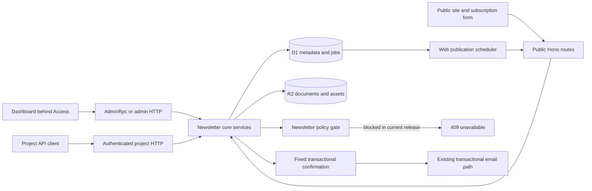

# Newsletter implementation plan

Date: 1 October 2026.
Status: Partly replaced. Read [redesign-plan.md](redesign-plan.md) first. It removes the provider gate (sections 4 and 9 here), replaces the editor, and adds Workers AI. Where the two documents disagree, redesign-plan.md wins.
Product contract: [Newsletter design](design.md).

## 1. Instructions for the implementation agent

Implement the design in stages S0–S7 below.
Keep the Cloudflare newsletter restriction active in every released build.
Use the existing Flaresend components, authentication, typed errors, and project boundaries.
Do not replace the dashboard or change the existing transactional API contract.
Do not add an external email provider.
Do not deploy or send live newsletter email as part of the implementation.

The current release can support real public articles and real subscribers.
It must reject newsletter sends, newsletter test sends, and newsletter email schedules.
Use a test-only provider to verify the future delivery engine.
A later release must separately activate the real newsletter adapter.

Read both documents before code changes.
Inspect applicable `AGENTS.md` files before edits in their directories.
Use the repository's test conventions.
Report completed stages, checks, and remaining defects at each handoff.

## 2. Current repository and reuse boundaries

These observations describe the inspected repository on the document date.

| Existing file or area | Current behavior | Required treatment |
| --- | --- | --- |
| `apps/dashboard/src/lib/nav.ts` | Project routes and sidebar items | Add the per-project Newsletters section |
| `apps/dashboard/src/components/shell/` | Project switcher, sidebar, command palette, mobile shell | Reuse |
| `apps/dashboard/src/components/ui/` | Fields, buttons, tables, sheets, dialogs, and state components | Reuse |
| `apps/dashboard/src/app/globals.css` | Theme tokens and typography | Preserve; check contrast in new screens |
| `apps/dashboard/src/components/broadcast-composer.tsx` | HTML-based broadcast editor | Use as a behavior reference; do not use as the newsletter editor |
| `apps/dashboard/src/lib/mailer.ts` | Admin RPC with an HTTP development fallback | Extend both transports |
| `apps/dashboard/src/lib/mailer-http.ts` | HTTP implementation of the admin contract | Keep parity with AdminRpc |
| `apps/dashboard/src/middleware.ts` | Cloudflare Access protects the complete dashboard | Keep public pages outside this dashboard |
| `packages/types/src/contacts.ts` | Contacts, audiences, broadcasts, and their input schemas | Preserve legacy contracts |
| `packages/types/src/admin-rpc.ts` | Typed dashboard service interface | Add newsletter methods |
| `apps/mailer/src/core/contacts.ts` | Contact-level unsubscribe token and contact updates | Add publication-specific subscriptions separately |
| `apps/mailer/src/core/broadcasts.ts` | Live audience traversal, 100-contact chunks, and a default 500-recipient cap | Do not use directly as the newsletter delivery engine |
| `apps/mailer/src/core/send.ts` | Shared email preparation, persistence, and queue entry | Add an internal purpose and newsletter policy check |
| `apps/mailer/src/core/provider.ts` | The sole `env.EMAIL` adapter | Preserve the transactional adapter; reject newsletter purpose |
| `apps/mailer/src/queue/send-consumer.ts` | Retries, provider calls, and provider acceptance | Add a final policy and recipient eligibility check |
| `apps/mailer/src/cron/scheduled.ts` | Five-minute schedule, broadcast progression, and reports | Add bounded web jobs and future dispatch recovery |
| `apps/mailer/src/http/routes/tracking.ts` | Public tracking and legacy unsubscribe routes | Preserve legacy tokens; add separate newsletter routes |
| `apps/mailer/src/db/suppressions.ts` | Address suppressions across the installation | Keep them authoritative |
| `apps/mailer/migrations/0006_scheduled_and_contacts.sql` | Contacts, audiences, and broadcasts | Add new tables; do not reinterpret old rows |
| `packages/client/src/` | REST and RPC clients | Add typed newsletter operations without breaking old methods |

The current broadcast `sent` counter means the application accepted work into its email path.
It does not establish final delivery.
The current consumer can retry a provider call after a crash.
The new newsletter path must explicitly address an uncertain provider result.

## 3. Architecture

Keep the existing Hono mailer Worker, D1 database, R2 bucket, and dashboard.
Serve public publication pages from new Hono routes on `PUBLIC_BASE_URL`.
Do not place public routes behind the dashboard's Cloudflare Access middleware.



Public routes use server-selected project and publication IDs from the URL lookup.
An unauthenticated request cannot supply a different internal ownership boundary.
All admin and project operations verify project ownership for every referenced ID.
The existing dashboard Access policy controls administrator access.
The first release does not introduce a new role system.

Use a pure newsletter renderer shared by preview, web publication, and future email output.
The renderer accepts validated document JSON, theme data, and explicit personalization values.
It does not query D1 or call a provider.

Required configuration additions:

- `NEWSLETTER_TOKEN_SECRET`: a secret for signed unsubscribe tokens and import preview tokens, with purpose separation.
- `NEWSLETTER_ADDRESS_SECRET`: a separate secret for address HMACs.
- `NEWSLETTER_PUBLIC_RATE_LIMITER`: a dedicated public-request rate-limit binding.
- A key ID and retained verification keys for unsubscribe token rotation.

Reuse `PUBLIC_BASE_URL`, `DB`, and `PAYLOADS`.
Require HTTPS and a public host distinct from the protected dashboard host.
Expose missing configuration as a setup check, without exposing secret values.
Use the existing private R2 bucket with explicit newsletter key prefixes.

### Editor choice

Use the open-source Tiptap React editor with an allowlisted schema.
Do not use paid Tiptap services, cloud storage, or collaboration features.
Use `immediatelyRender: false` in the Next.js client component.
Pin compatible dependency versions during implementation.
Source: [Tiptap Next.js guide](https://tiptap.dev/docs/editor/getting-started/install/nextjs).

Normalize editor JSON into a versioned Flaresend document schema.
Do not make raw Tiptap extension output the permanent public API contract.
Implement explicit conversion tests in both directions.

## 4. Capability contract and the provider gate

Add a single server capability function with this response shape:

```ts
type NewsletterCapabilities = {
  provider: "cloudflare";
  policyVersion: "cloudflare-transactional-only-2026-10-01";
  newsletterEmail: false;
  newsletterTestEmail: false;
  newsletterEmailSchedule: false;
  promotionalWelcomeEmail: false;
  webPublication: boolean;
  subscriptionConfirmation: boolean;
  reasonCode: "provider_transactional_only";
  policyUrl: "https://developers.cloudflare.com/email-service/reference/faq/";
};
```

The four email capability values are literal `false` in the current production policy.
No environment variable, project field, API parameter, or admin toggle can override them.
The function derives the web and confirmation values from actual setup and project state.
The dashboard uses this response for the notice and controls.
An unavailable or malformed capability response fails closed for email actions.

Add `requireNewsletterEmailCapability()` to all newsletter delivery commands.
Call it before any persistent mutation or quota reservation.
Call it again in the dispatcher, queue consumer, and provider adapter.
Reject a newsletter preview-send request even when the recipient is the administrator.
An HTML preview is not a provider send.

Persist an internal `purpose` on each email row:

- `transactional`: the legacy default.
- `subscription_confirmation`: a fixed system message after a public request.
- `newsletter`: a future newsletter or promotional welcome message.

Public inputs cannot set or overwrite this field.
Use explicit newsletter foreign keys, not editable email tags, to establish provenance.
Preserve the purpose and provenance through resend, schedule, batch, RPC, and queue operations.
The generic resend endpoint must reject a newsletter email and direct the caller to the newsletter retry operation.

Newsletter preview data must not enter the generic broadcast composer automatically.
Do not create legacy broadcasts for newsletter runs.
Existing generic HTML APIs cannot infer the intent of arbitrary content.
This design enforces newsletter-owned paths; it does not claim semantic classification of every legacy email.
Keep the existing transactional-use notice in the legacy documentation.

### Eventual activation

Do not use a cron job that watches the FAQ and enables delivery automatically.
A later code release must verify these conditions:

1. Cloudflare explicitly supports the intended newsletter use.
2. The deployed account has the required access and quotas.
3. The adapter supports the required headers and event correlation.
4. The retry design accounts for provider idempotency or ambiguous outcomes.
5. The sender passes the required domain checks.
6. The delivery tests pass against the supported provider contract.

That release can add an explicit project opt-in beneath the provider capability.
It must not activate old drafts, old imports, or old planned content automatically.
The administrator must review a post and select Send or Schedule after activation.

## 5. Data model

Use additive D1 migrations after the latest existing migration.
The inspected latest migration is `0009_created_indexes.sql`; check again before choosing a new number.
Use the existing ID helpers, UTC ISO timestamps, prepared statements, and keyset pagination.
Use `CHECK` constraints for status values and booleans.
Use project-qualified composite references where they prevent cross-project associations.

The following lists define required fields, not literal migration SQL.
All mutable records also have `created_at` and `updated_at` unless stated otherwise.

| Table | Required fields and constraints |
| --- | --- |
| `publications` | `id`, `project_id`, `name`, `slug`, `description`, `timezone`, `status`, `site_enabled`, `form_enabled`, `theme_json`, `logo_asset_id`, `from_address`, `from_name`, `reply_to`, `postal_address`, `revision`; unique `(project_id, slug)` |
| `newsletter_subscriptions` | `id`, `project_id`, `publication_id`, `contact_id`, `status`, `source`, `consent_text_version`, `consent_source`, `consent_at`, `confirmed_at`, `unsubscribed_at`, `revision`; unique `(publication_id, contact_id)` |
| `newsletter_subscription_events` | `id`, ownership IDs, `subscription_id`, `type`, `occurred_at`, `actor_kind`, minimal `data_json`; append-only |
| `newsletter_tags` | `id`, ownership IDs, `name`; unique `(publication_id, name)` |
| `newsletter_subscription_tags` | `project_id`, `publication_id`, `subscription_id`, `tag_id`; unique `(subscription_id, tag_id)` |
| `newsletter_posts` | `id`, ownership IDs, `slug`, `title`, `subtitle`, `subject`, `subject_overridden`, `preview_text`, `author_label`, `draft_revision_id`, `public_revision_id`, `web_status`, `web_scheduled_at`, `web_scheduled_revision_id`, `published_at`, `archived_at`, `revision`; unique `(publication_id, slug)` |
| `newsletter_post_revisions` | `id`, ownership IDs, `post_id`, `number`, `document_schema_version`, `document_r2_key`, `render_r2_prefix`, `content_hash`, immutable `metadata_json`, `created_at`; unique `(post_id, number)` |
| `newsletter_assets` | `id`, ownership IDs, `r2_key`, `mime_type`, `size_bytes`, `width`, `height`, `status`, `created_at` |
| `newsletter_tokens` | `token_hash`, ownership IDs, `subscription_id`, `subscription_revision`, `purpose`, `expires_at`, `consumed_at`, `created_at`; no raw token |
| `newsletter_imports` | `id`, ownership IDs, `status`, `file_r2_key`, `mapping_json`, `consent_json`, `cursor`, outcome counts, `error_r2_key`, `request_key`, `request_hash`; unique `(project_id, request_key)` |
| `newsletter_import_rows` | `import_id`, `row_number`, `outcome`, `contact_id`, `error_code`; unique `(import_id, row_number)` |
| `newsletter_jobs` | `id`, ownership IDs, `kind`, `entity_id`, `generation`, `due_at`, `status`, `lease_token`, `lease_until`, `attempts`, `last_error`; unique `(kind, entity_id, generation)` |
| `newsletter_commands` | `project_id`, `idempotency_key`, `request_hash`, `result_json`, `created_at`; unique `(project_id, idempotency_key)` |
| `newsletter_email_runs` | `id`, ownership IDs, `post_id`, `revision_id`, `filter_json`, `snapshot_at`, `status`, `scheduled_at`, `started_at`, `completed_at`, `provider_policy_version`, `request_key`, `request_hash`, `lease_token`, `lease_until`; unique `(project_id, request_key)` |
| `newsletter_run_recipients` | `id`, ownership IDs, `run_id`, `subscription_id`, `contact_id`, `email_id`, `address_snapshot`, `personalization_json`, `status`, `skip_reason`, `attempts`, `lease_token`, `lease_until`, `provider_message_id`, `accepted_at`, `delivered_at`; unique `(run_id, subscription_id)` |
| `newsletter_address_blocks` | `project_id`, `publication_id`, `address_hmac`, `reason`, `created_at`; unique `(publication_id, address_hmac)` |

The email-run tables can remain empty in the first release.
Create them in S6 with the future engine, not as a prerequisite for the editor.
Add nullable `newsletter_run_id` and `newsletter_recipient_id` fields to the existing email table.
Add the internal purpose field with the legacy default.
Use normalized columns for lookups; do not query JSON tags as the primary delivery join.

Use these initial state enums:

- Publication: `draft`, `active`, `archived`.
- Subscription: `pending`, `subscribed`, `unsubscribed`.
- Web post: `draft`, `scheduled`, `published`, `unpublished`.
- Asset: `draft`, `public`, `deleted`.
- Import: `queued`, `processing`, `completed`, `failed`, `canceled`.
- Job: `pending`, `leased`, `completed`, `failed`, `canceled`.

The publication becomes active after the user completes identity setup.
Site and form availability remain separate booleans with setup checks.
A public article can remain visible when its publication is archived.
Public subscription routes require an active publication.
Public article routes require an enabled site and a public revision.
Post archive remains an independent timestamp because it does not change public visibility.

Required indexes:

- Publications by `(project_id, created_at, id)`.
- Subscriptions by `(publication_id, status, created_at, id)` and `(contact_id, publication_id)`.
- Subscription events by `(publication_id, occurred_at, id)` and `(subscription_id, occurred_at, id)`.
- Tags by `(tag_id, subscription_id)`.
- Posts by `(publication_id, updated_at, id)` and `(publication_id, web_status, published_at, id)`.
- Jobs by `(status, due_at, id)`.
- Runs by `(status, scheduled_at, id)`.
- Recipients by `(run_id, status, id)` and unique `email_id` when present.
- Tokens by `(expires_at)`.

The migration must not create subscriptions from existing contacts or audiences.
An audience membership does not prove newsletter consent.
Offer a reviewed import from an existing audience with the same consent requirements as CSV.

### Contact and unsubscribe precedence

Reuse `contacts` as the project address book.
A publication subscription is a separate relation, not a replacement contact record.
Effective newsletter eligibility requires all these conditions:

```text
publication.status == active
project.disabled_at == null
subscription.status == subscribed
contact.unsubscribed == 0
no installation suppression for the normalized address
no publication address block
recipient matches the selected publication filter
```

Normalize an email address with the current schema's trim and lowercase behavior.
Do not remove plus suffixes or alter mailbox dots.
Adding a publication subscription never clears a contact-level unsubscribe or an installation suppression.

A new newsletter unsubscribe changes only the selected publication subscription.
The existing `/u/:token` retains its legacy contact-level behavior.
The UI explains when that contact-level flag blocks every publication in the project.
Existing transactional email remains subject to its current suppression behavior.

## 6. Document, asset, and revision contract

Use `schemaVersion: 1` with a discriminated union of the blocks in the design.
Every block has a stable ID.
Represent personalization as `{ type: "personalization", field: "firstName" | "lastName", fallback: string }`.
Reject unsupported blocks, marks, URLs, and schema versions on the server.

Limits for the first release:

- At most 200 blocks per post.
- At most 256 KiB of document JSON.
- At most 100 characters in the title and 200 in the subtitle.
- At most 200 characters in the newsletter subject and 200 in the preview text.
- At most 5 MiB per uploaded image.
- PNG, JPEG, and WebP images only.
- At most 4096 pixels on either image axis after normalization.
- No HTML blocks, scripts, iframes, external embeds, attachments, or remote URL imports.

Keep the existing generic email subject limit unchanged.
The newsletter editor can impose the smaller product limit above.

Use an explicit AST-to-HTML renderer for the supported blocks.
Escape all text and attribute values.
Generate email HTML with table structure and inline styles suitable for email clients.
Generate web HTML separately with semantic elements.
Generate plain text from the AST, including button URLs and the managed footer.
Do not regex-sanitize arbitrary HTML and treat it as safe.

The publication theme has a small validated schema.
It accepts preset fonts, a valid accent color, and controlled layout values.
It rejects arbitrary CSS, font URLs, and script content.

Write an immutable R2 object before the D1 pointer update.
Use a conditional D1 update with the expected revision.
If the update affects no row, return `409 revision_conflict`.
Do not let dependent batch statements commit when that condition fails.
Use the expected revision in their predicates or a constraint that aborts the batch.

D1 and R2 do not share a transaction.
A failed D1 update can leave an unreferenced R2 object.
Clean such objects after 24 hours, only after a reference check.
Never delete a published revision or a revision referenced by an email run.

Asset upload requires an authenticated project operation.
Verify the file signature, size, and dimensions on the server.
Do not trust the filename or browser MIME value.
Serve draft assets only through authenticated preview routes.
Expose public asset URLs only after an article references the asset in a public revision.
Use an ownership lookup and `X-Content-Type-Options: nosniff` on asset responses.

An edit to a published post creates a new draft revision.
The public pointer remains unchanged until **Publish update** succeeds.
An email run always points to an immutable revision and theme snapshot.
A public update never changes an email that already left the service.

## 7. Subscriptions, imports, and data controls

### Public subscription sequence

1. Resolve an active publication with an enabled form and configured confirmation sender.
2. Validate the email address, optional name, consent version, and source.
3. Apply rate limits before contact lookup or email creation.
4. Upsert the contact without clearing existing unsubscribe values.
5. Create or retain the publication subscription.
6. Create a random token with at least 256 bits of entropy.
7. Store only its SHA-256 hash with a 24-hour expiry.
8. Queue the fixed transactional confirmation email with an idempotency key.
9. Return the generic accepted response without subscription status details.

An existing subscribed address does not require another confirmation email.
A pending subscription can receive another link after the cooldown.
An unsubscribed person can request a fresh confirmation, but the request does not activate the subscription.
A consumed, expired, or superseded token cannot activate it.
The confirmation POST atomically consumes the valid token and records the subscription transition.
A concurrent unsubscribe increments the subscription revision and invalidates older confirmation tokens.
Before a confirmation provider call, recheck the token revision and expiry.
Allow only a pending subscription or an explicit resubscription request for an unsubscribed record.
Use the token hash as part of the confirmation email's stable idempotency key.

Use a new confirmation to remove a publication-level unsubscribe block when the same person requests subscription again.
Do not clear a complaint, hard-bounce suppression, or contact-level unsubscribe through that flow.
Show a neutral status page if an account-wide block prevents activation.

Suggested initial abuse limits: five requests per address per hour and twenty requests per IP per ten minutes.
Apply an additional publication-wide budget to protect the transactional quota.
Return `429` with `Retry-After` for excess requests without disclosing membership.
Use atomic D1 counters for the address cooldown and publication budget.
Use a dedicated rate-limit binding for the public IP limit.
Do not assume the existing project API rate limiter prevents subscription abuse.
Keep a hidden honeypot field and a minimum submission interval as additional signals.
Do not add a CAPTCHA dependency to the first release.

### Unsubscribe

Use a new route `/n/u/{token}` with a purpose-specific signed token.
Include the publication and subscription identifiers in the signed payload.
Use an independent secret and a key ID for rotation.
Keep old verification keys available while corresponding emails remain valid.
Do not impose a short expiry on unsubscribe links.

GET displays a confirmation page without a mutation.
POST performs an idempotent unsubscribe.
After email activation, the POST also accepts `List-Unsubscribe=One-Click` without cookies or a login.
The email renderer must emit both unsubscribe headers and a visible footer link.
Do not track or rewrite unsubscribe or confirmation URLs.

### Import

Support at most 5,000 rows and 5 MiB in one CSV upload initially.
Support a publication with 10,000 subscribers as the first release performance target.
Allow more than one import to reach that size.
Do not present this target as an email throughput promise.

Store the original import file in private R2 storage.
Parse it with a CSV library that supports quotes, embedded newlines, BOMs, and escaped delimiters.
Map email, first name, last name, tags, and source.
Require email and consent evidence.
Treat duplicate normalized addresses as one candidate; show the duplicate count before the import.

Use import row outcomes and a cursor for resumable chunks.
Commit row effects and outcomes in the same D1 batch.
Use an idempotency key per import request and unique row numbers.
After a retry, derive totals from row outcomes instead of incrementing unchecked counters.
Bound each chunk by the repository's D1 parameter limits.

A consent-backed import may create a subscribed record.
It must never reactivate a previous unsubscribe or bypass a suppression.
It must not send confirmation or welcome email to the entire imported list.
Delete the source and error files after seven days.
Retain the minimal consent provenance in the subscription events.

### Export and deletion

Export only the selected publication's subscribers after project authorization.
Escape CSV cells that start with `=`, `+`, `-`, `@`, tab, or carriage return.
Keep exports out of the public asset path.

Publication deletion removes that publication's personal subscription data.
It does not delete a shared contact required by another publication or a legacy audience.
The existing contact deletion path must check newsletter references and cancel unsent recipient work.
After activation, redact recipient snapshots when a personal-data deletion requires it.
Preserve aggregate counts without the address or name.

Retain a purpose-limited address HMAC after an unsubscribe or deletion to prevent accidental import reactivation.
Use a dedicated secret and document retention and key rotation.
This record is pseudonymous suppression data, not anonymous data.
The deployment owner must set an appropriate retention policy before a production launch.

## 8. Web publication and schedules

Public pages resolve a public revision from D1 before any cached body response.
Use an R2 render cache keyed by the immutable revision ID.
The first release sends `Cache-Control: no-store` on article and archive responses.
This keeps unpublish behavior immediate and avoids an incomplete cache-invalidation design.
Public immutable images can use a long cache lifetime after the publication check.

Preview endpoints require authentication and send `no-store`.
Do not make unpublished previews public through guessable post IDs.
Add a restrictive CSP to public HTML.
Allow only the required image origins, form actions, and stylesheet sources.
Public forms do not need client JavaScript to submit.

Store a web schedule as an immutable revision ID, a UTC instant, and the chosen IANA timezone.
Insert the job and update the post state in one conditional D1 batch.
Use `web_scheduled → published` as a compare-and-swap transition.
Two cron invocations must not publish two revisions or emit duplicate publication events.

Keep the current five-minute cron cadence for the first release.
Show that web publication can start up to five minutes after the selected time under normal operation.
A service failure can cause a longer delay.
Process a bounded number of jobs and resume remaining jobs on the next tick.
Use a lease token and lease expiry for work that extends beyond one transaction.
Require the current lease token on every completion update.

Canceling a schedule invalidates its job generation.
An old job must compare the current generation and revision before publication.
Pause due jobs while the project is paused.
Resume eligible web jobs after the project resumes, with the delayed time visible.
An archived publication does not process new jobs.

## 9. Future email delivery engine

Implement the core state machine with an injected fake provider in S6.
The production gate remains false.
Do not connect the future engine to live Cloudflare newsletter delivery in this release.

### Recipient selection and content freeze

A review request returns the draft revision, eligible count, excluded counts, and filter definition.
It does not reserve recipients or send email.
At a future Send or Schedule command, revalidate the policy and all inputs.
Freeze the content, theme, sender, headers, and recipient set at command acceptance.
Scheduled email uses this fixed set; subscribers added later do not join the run.
Explain that rule next to the recipient count.

For the initial 10,000-subscriber target, create the snapshot with a bounded `INSERT ... SELECT` in the run transaction.
Include the same eligibility query used by the review count.
Keep that query in one core module.
Verify its cost with 10,000 rows before release.
Do not paginate against a changing live list and call it a fixed snapshot.

Every recipient keeps the address and personalization values from this snapshot.
The dispatcher rechecks subscription status, global suppression, publication blocks, project pause, and provider capability before the provider call.
An address change after the snapshot skips that recipient; it does not redirect the message to a new address.
An unsubscribe after the snapshot skips unsent work.
An unsubscribe after the provider call cannot recall the message.

### States

```text
run:
  scheduled -> preparing -> dispatching -> completed
                                      -> partial
                                      -> needs_attention
  scheduled/preparing/dispatching -> paused | canceled
  paused -> preparing | dispatching       (explicit resume after revalidation)

recipient:
  pending -> queued -> in_flight -> accepted
                              -> retry_wait -> queued
                              -> failed
                              -> unknown
  pending/queued/retry_wait -> skipped | canceled
  accepted -> delivered | bounced
```

The existing email event model records complaints and engagement after acceptance.
Do not reduce all these signals into one lossy recipient status.
Use status for dispatch outcome and timestamps or events for later observations.
The table above uses delivered and bounced as the visible delivery outcome.
The implementation must retain the accepted timestamp and original provider identifier.

Use `completed` only when every selected recipient reached acceptance.
Partial means the run contains accepted recipients and final failures or skips.
Needs attention includes an unknown provider result or a failure before useful dispatch.
Final report counts come from recipient rows and unique events, not increment-only run counters.

### Idempotency, leases, and queue recovery

Cloudflare Queues provides at-least-once delivery.
Source: [Queue delivery guarantees](https://developers.cloudflare.com/queues/reference/delivery-guarantees/).

Use a stable key such as `newsletter:{runId}:{subscriptionId}` throughout the email path.
Persist it beyond the queue retry period.
Reject a reused command key with a different request hash.
Use a unique `(run_id, subscription_id)` constraint and a unique email association.

Atomically claim recipients with a lease token and an expiry.
Use a job generation to reject stale queue messages.
Treat pending recipient rows as a durable outbox.
The dispatcher can retry queue insertion after a crash without creating another recipient or email.
The queue consumer claims the existing recipient; it does not allocate a new one.

Prepare the R2 email payload before the provider boundary.
Commit the email row, recipient association, and durable outbox state together before queue submission.
Recover a failed queue submission from D1.
Reclaim an expired lease only when the provider boundary was not crossed.

If a provider call times out after possible acceptance, record `unknown`.
Do not automatically send that recipient again without provider idempotency or authoritative reconciliation.
An outbox prevents lost application work; it does not establish exactly-once external delivery.
The implementation must not claim that guarantee.

Apply the provider's retry classification after the future API contract becomes available.
Use exponential backoff and a finite retry limit for known temporary failures.
Use a separate newsletter queue with bounded concurrency and a dead-letter queue.
Keep transactional work on the existing queue.
Keep the newsletter queue disconnected from real dispatch while the capability is false.

### Cancel, pause, and failure

Cancel stops new claims and marks known unsent recipients canceled.
It cannot recall provider-accepted or in-flight messages.
Show those counts in the cancellation result.
A project pause prevents new provider calls and preserves remaining work.
A capability withdrawal pauses the run and requires explicit administrator review before resume.

Retry targets the same failed recipient rows and original content revision.
It never creates a fresh run for already accepted recipients.
A changed post requires a new explicit delivery operation after activation.
The first release excludes a Send again action for an already delivered edition.

### Delivery events and reports

Join provider events to the existing email and newsletter recipient IDs.
Deduplicate events with the provider event ID where available.
Handle out-of-order acceptance, delivery, bounce, and complaint events without clearing prior evidence.
Keep the existing orphan-event recovery path.
Count unique opens and clicks once per recipient for rate calculations.
Exclude previews, tests, and confirmation emails from newsletter reports.

## 10. API and transport contract

Mount authenticated newsletter routes under the existing project router.
They then serve both `/v1/...` and `/v1/admin/projects/{slug}/...`.
Mirror them in `AdminRpcApi`, `AdminRpc`, the dashboard HTTP adapter, and the public SDK where appropriate.
Do not copy core behavior into transport handlers.

Use the existing error envelope and `ListResponse` pagination format.
Use camelCase for JSON and snake_case for database fields.
Default list limits to 25 and cap them at 100.
Require `expectedRevision` for mutable publication and post writes.
Require `Idempotency-Key` for publication commands, imports, and future delivery commands.
Use a 24-hour retention for completed command receipts in the first release.
Keep delivery uniqueness in the recipient tables for the life of the run.

| Method and relative path | Input | Result |
| --- | --- | --- |
| `GET /newsletter-capabilities` | None | Capability contract |
| `GET /publications` | Cursor, limit | Publication list |
| `POST /publications` | Name, slug, description, timezone, theme | Publication |
| `GET /publications/:id` | None | Publication and setup state |
| `PATCH /publications/:id` | Allowed fields, expectedRevision | Updated publication |
| `POST /publications/:id/archive` | Expected revision | Archived publication |
| `POST /publications/:id/site/publish` | Expected revision | Public-site state |
| `POST /publications/:id/site/unpublish` | Expected revision | Private-site state |
| `GET /publications/:id/posts` | State, cursor, limit | Post list |
| `POST /publications/:id/posts` | Initial title and optional document | Draft post |
| `GET /publications/:id/posts/:postId` | None | Metadata and draft document |
| `PATCH /publications/:id/posts/:postId` | Expected revision, document or metadata | New draft revision |
| `DELETE /publications/:id/posts/:postId` | Expected revision | Draft deletion result |
| `POST /publications/:id/posts/:postId/duplicate` | None | New draft |
| `POST /publications/:id/posts/:postId/archive` | Expected revision | Archived post; public visibility unchanged |
| `POST /publications/:id/posts/:postId/preview` | Revision ID, target, optional sample subscription | Safe HTML or plain text |
| `POST /publications/:id/posts/:postId/review` | Revision ID, filter, channels | Checks, counts, capability, content hash |
| `POST /publications/:id/posts/:postId/publish-web` | Expected revision, revision ID, optional schedule and timezone | Published or scheduled state |
| `POST /publications/:id/posts/:postId/cancel-web-schedule` | Expected revision | Draft state |
| `POST /publications/:id/posts/:postId/unpublish-web` | Expected revision | Private post state |
| `POST /publications/:id/posts/:postId/send-test` | Revision ID and recipient | Current release: 409 |
| `POST /publications/:id/posts/:postId/send-email` | Revision ID, filter, expected count, optional schedule | Current release: 409 |
| `GET /publications/:id/subscribers` | Filters, cursor, limit | Subscription list |
| `GET /publications/:id/subscribers/:subscriptionId` | None | Details and consent timeline |
| `PATCH /publications/:id/subscribers/:subscriptionId` | Expected revision, names, tags | Details; status excluded |
| `POST /publications/:id/subscribers/:subscriptionId/unsubscribe` | Expected revision | Subscription state |
| `DELETE /publications/:id/subscribers/:subscriptionId` | Expected revision | Personal-data deletion result |
| `POST /publications/:id/imports` | Uploaded file ID, mapping, consent, preview token | Durable import ID |
| `GET /publications/:id/imports/:importId` | None | Progress and authorized error-file link |
| `POST /publications/:id/imports/preview` | Uploaded file ID and mapping | Counts and signed preview token |
| `POST /publications/:id/imports/from-audience` | Audience ID, consent, expected contact count | Durable import ID with a fixed contact snapshot |
| `POST /publications/:id/export` | Filter | Streamed CSV for the bounded initial limit |
| `GET /publications/:id/tags` | None | Publication tags |
| `POST /publications/:id/tags` | Name | New tag |
| `DELETE /publications/:id/tags/:tagId` | None | Tag and membership removal |
| `POST /publications/:id/assets` | Multipart image | Validated asset ID |
| `POST /publications/:id/import-files` | Multipart CSV | Private file ID |
| `GET /publications/:id/reports` | Date range | Subscriber metrics and email availability |

The signed import preview token binds the file hash and mapping hash.
A changed file or mapping requires another preview.
All file IDs require project and publication ownership checks.
Assets and imports require byte limits before full request buffering.
The audience import uses the same row ledger, consent checks, and unsubscribe precedence as the CSV import.
It rejects an audience from another project.
The future run API adds get, list, cancel, resume, and retry operations under `/publications/:id/email-runs`.
Current production commands for a run return the same unavailable error; fixture tests call the core service directly.

Public endpoints live outside `/v1` authentication:

- `POST /n/{projectSlug}/{publicationSlug}/subscribe`.
- `GET /n/confirm/{token}` and `POST /n/confirm/{token}`.
- `GET /n/u/{token}` and `POST /n/u/{token}`.
- The public pages and RSS route from the design.

The public subscription endpoint accepts only its small form schema.
It never accepts a sender, template, subject, HTML, or arbitrary redirect URL.
Use a strict origin check for browser form requests and a public-form rate limit.
The iframe form posts from its own origin.
Unsubscribe POST remains usable by a mail provider without a browser Origin header.

Required typed errors include:

```text
newsletter_email_unavailable   revision_conflict
publication_not_found         publication_archived
publication_slug_exists       public_site_not_configured
confirmation_sender_unready   invalid_document
invalid_asset                 import_preview_stale
invalid_schedule              subscription_not_found
idempotency_payload_mismatch  no_eligible_recipients
```

### Example: a blocked delivery request

```http
POST /v1/publications/pub_01/posts/post_01/send-email
Authorization: Bearer <project-key>
Idempotency-Key: newsletter-post-01-delivery-01
Content-Type: application/json

{"revisionId":"rev_03","filter":{"status":"subscribed"},"expectedCount":128}
```

```json
{
  "error": {
    "type": "conflict",
    "code": "newsletter_email_unavailable",
    "message": "Cloudflare does not support newsletter email yet. Save a draft or publish on the web."
  }
}
```

The existing `ApiError.conflict()` produces this error type and HTTP status.
Preserve the code and behavior above.

## 11. Proposed file map

These are proposed additions; they do not exist yet.

| Area | New files or directory | Existing integrations |
| --- | --- | --- |
| Types | `packages/types/src/newsletters.ts` | `index.ts`, `admin-rpc.ts`, email purpose types |
| Core | `apps/mailer/src/core/newsletters/` with policy, publications, posts, subscriptions, imports, render, reports, and delivery modules | `core/send.ts`, `core/emails.ts`, `core/admin.ts`, `core/provider.ts` |
| Database | `apps/mailer/src/db/newsletters/` and additive migrations | Contacts, emails, events, suppression joins |
| Public HTTP | `apps/mailer/src/http/routes/newsletter-public.ts` | `http/app.ts` before protected `/v1` routes |
| Project HTTP | `apps/mailer/src/http/routes/newsletters.ts` | `projectRouter()` |
| Background jobs | `apps/mailer/src/cron/newsletters.ts` | `cron/scheduled.ts`, import recovery, cleanup |
| Future queue | `apps/mailer/src/queue/newsletters-consumer.ts` | `index.ts`, `env.ts`, Wrangler queue bindings, DLQ handling |
| Dashboard | `apps/dashboard/src/app/[slug]/newsletters/` | Existing layouts, `app/actions.ts` conventions |
| UI | `apps/dashboard/src/components/newsletters/` | Shared UI, shell, sender helpers, HTML preview |
| Client | Newsletter methods in `packages/client/src/` | HTTP, RPC, exports, type tests |
| Documentation | Newsletter guides in `apps/docs` | Read that directory's AGENTS.md first |

Use domain modules with shared core functions.
Avoid one large route file with embedded SQL, rendering, and queue logic.
No new ORM, frontend framework, or general automation engine is necessary.

## 12. Stages and acceptance criteria

Each stage produces a usable vertical slice and its relevant tests.
The next stage can start after the previous stage's contract tests pass.

### S0 — Policy boundary and navigation

Add the capability response, the typed error, the sidebar route, and the provider notice.
Add internal email purpose support with a legacy-compatible default.
Keep existing transactional routes operational.

Acceptance:

- The exact Cloudflare quotation appears in the full notice.
- All new newsletter email commands return 409 before a write or queue operation.
- A forged queue message with newsletter purpose cannot reach `env.EMAIL.send`.
- The API, RPC, and HTTP fallback return the same capability result.
- The All projects navigation selects a project before newsletter work.

### S1 — Publications and setup

Add publication tables, revision checks, CRUD contracts, and the setup flow.
Add the overview and publication list.

Acceptance:

- A person creates a newsletter without a sender or subscriber list.
- The selected layout persists after a reload.
- Duplicate slugs return an inline conflict.
- Cross-project ID access returns a not-found response.
- The existing theme and mobile shell remain intact.

### S2 — Editor, assets, and previews

Add the document schema, Tiptap adapter, immutable revisions, uploads, and pure renderers.
Add the editor, autosave, preview sheet, and post list.

Acceptance:

- Every supported block survives save, reload, and edit without content loss.
- Concurrent edits produce a conflict instead of silent overwrite.
- An R2 failure preserves the last valid draft pointer.
- Malicious pasted HTML, URLs, filenames, and unsupported nodes cannot execute code.
- Email, web, and plain text output use the same content revision.
- The newsletter test-send control remains disabled.
- The mobile editor works at 375px with a keyboard-accessible toolbar.

### S3 — Public site and web schedules

Add public home, archive, article, feed, preview isolation, and web jobs.
Add the review page with Web only as its current default.

Acceptance:

- A public article works without a dashboard Access session.
- A private post is absent from the archive, RSS feed, and direct public URL.
- A scheduled post uses the frozen revision at the selected UTC instant.
- Concurrent cron ticks publish one result.
- Cancellation prevents a stale job from publication.
- A public update does not change the previous immutable revision.
- Unpublish takes effect on the next request.

### S4 — Subscriber collection and unsubscribe

Add subscriptions, consent events, transactional confirmations, forms, and new unsubscribe tokens.
Add the subscriber table and details page.

Acceptance:

- A GET to a confirmation or unsubscribe link has no mutation.
- A valid confirmation POST activates one subscription once.
- An expired or superseded token fails without address disclosure.
- A newsletter unsubscribe affects one publication only.
- A legacy contact-level unsubscribe still blocks future newsletter eligibility.
- A confirmation request cannot inject newsletter content into a transactional email.
- Repeated requests respect the address, IP, and publication budgets.
- The public form clearly states that newsletter email has not started.

### S5 — Imports, tags, reports, and deletion

Add durable CSV imports, exports, tags, filters, and subscriber reports.
Connect deletion to the existing contact lifecycle.

Acceptance:

- A 5,000-row import resumes after interruption without duplicate subscriptions or inflated counts.
- An import preserves unsubscribe and suppression records.
- Consent evidence survives an import retry.
- A CSV error export cannot execute spreadsheet formulas.
- Filters return consistent counts and result pages.
- A 10,000-subscriber fixture supports bounded queries and pagination.
- Personal-data deletion does not remove another publication's required contact data.
- Email reports show an unavailable state rather than fabricated performance figures.

### S6 — Future engine under a test-only provider

Add the run ledger, recipient snapshot, outbox, leases, cancellation, and event correlation.
Exercise the complete state machine through dependency injection.
Keep all production newsletter email entry points blocked.

Acceptance:

- Duplicate commands and queue messages do not allocate another recipient email.
- A queue insertion failure leaves durable work for recovery.
- A crash before the provider boundary permits a safe retry.
- An uncertain provider outcome becomes `unknown` without an automatic duplicate send.
- An unsubscribe after the snapshot skips the unsent recipient.
- A project pause stops new provider calls.
- A cancellation preserves accepted and in-flight counts.
- A repeated or out-of-order event does not inflate reports or remove delivery evidence.
- A production configuration cannot select the fake provider.
- The tests assert zero live Cloudflare newsletter calls.

### S7 — Release verification and documentation

Document setup, public URLs, the provider restriction, consent imports, and the future activation procedure.
Update bootstrap configuration only for the new public secrets, rate limits, and required bindings.
Do not change a deployed account during this stage without a deployment request.

Acceptance:

- Existing transactional email, broadcasts, templates, domains, and legacy unsubscribe tests still pass.
- REST, AdminRpc, and the dashboard HTTP fallback pass parity tests.
- A fresh database and a database with existing records both migrate successfully.
- Existing records remain accessible after the application update.
- The complete user flow passes at 1440px, 768px, and 375px in both themes.
- Keyboard navigation, focus, contrast, and reduced motion pass a manual review.
- The README clearly distinguishes web publication from unavailable newsletter email.

## 13. Verification commands and test matrix

Use these existing commands after the relevant changes:

```sh
pnpm --filter @flaresend/types test
pnpm --filter @flaresend/mailer test
pnpm --filter @flaresend/dashboard test
pnpm --filter @flaresend/client test
pnpm typecheck
pnpm --filter @flaresend/dashboard build
```

The OpenNext Worker bundle requires macOS, Linux, or WSL.
The Next.js build also works on Windows.
Report an unavailable runtime rather than a false pass.
Use local migrations and fake provider calls for automated tests.
The repository's local mailer configuration can send real email; do not use it for newsletter tests.

Add focused tests beside the existing mailer integration, dashboard helper, client, and type tests.
The key cases are ownership, state transitions, failure recovery, rendering safety, and transport parity.
Do not add only snapshots of the new UI markup.

| Scenario | Required assertion |
| --- | --- |
| Capability response fails | The UI and server do not enable email |
| Direct send/test/schedule calls | 409, no run, no payload, no provider call |
| Generic resend of newsletter provenance | Rejected; purpose cannot disappear |
| Two draft edits with the same revision | One succeeds; one returns 409 |
| D1 failure after R2 write | Old pointer remains valid; orphan cleanup is safe |
| Import retry after a chunk commit | Each row outcome counts once |
| Two confirmation POSTs | One transition and one consent event |
| Unsubscribe before confirmation | Old token cannot restore the subscription |
| Same contact in two publications | Independent subscription states |
| Scheduled web job runs twice | One public revision transition |
| Unknown provider outcome | No blind retry |
| Suppression after recipient snapshot | Provider call skipped |
| Provider notice text | Exact user quotation plus the current explanation |

## 14. Release and rollback

The first release uses additive schema changes.
Back up the database before production migrations through the normal deployment process.
Deploy the mailer contract before the dashboard that consumes it.
Keep the public feature disabled until its required configuration passes checks.
Enable web publication and forms through explicit publication actions.

Rollback disables newsletter public features and restores the previous application version.
Keep the additive tables and immutable content until a separate recovery review.
Do not drop newsletter data as part of an application rollback.
The provider gate stays closed throughout rollback and recovery.

Completion means S0–S7 meet their acceptance criteria with no live newsletter dispatch.
Real Cloudflare newsletter delivery belongs to a later release after the documented activation checks.

## 15. Evidence and unresolved external dependency

Cloudflare's future marketing API, quotas, and idempotency guarantees are not available in this design.
Do not invent them or promise a delivery throughput.
The first release does not depend on them.

D1 batch statements execute transactionally, but a zero-row conditional update is not itself a SQL failure.
The implementation must enforce dependent-write conditions explicitly.
Source: [D1 database API](https://developers.cloudflare.com/d1/worker-api/d1-database/).

The only external release dependency is Cloudflare's support for newsletter email.
All current product decisions have defaults in these documents.
The implementation agent can proceed with S0–S7 without another product interview.
